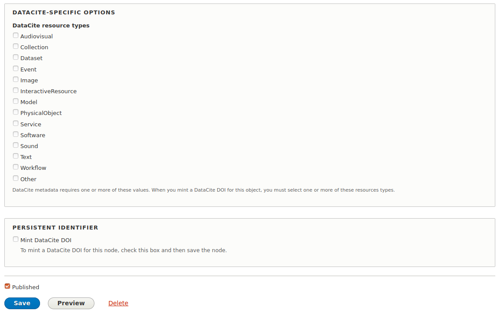

# DataCite DOI Minter

## Introduction

Drupal 8 Module that mints DOIs from DataCite via the Persistent Identifiers module.

Still in very early development.

## Requirements

* Drupal 8
* [Persistent Identifiers module](https://github.com/mjordan/persistent_identifiers)

## Installation

1. Clone this repo into your Islandora's `drupal/web/modules/contrib` directory.
1. Enable the module either under the "Admin > Extend" menu or by running `drush en -y doi_datacite`.

## Configuration

Visit `/admin/config/persistent_identifiers/settings` for options.

## Usage

See usage section in the Persistent Identifiers module's README.

## Specifying DataCite resource types

DataCite requires the use of a controlled vocabulary of resource types. This module adds this list to the node edit form, e.g.:

This list will appear if the user checks the "Mint DataCite DOI" box. Note that the items selected from this list are not persisted to the node, which means that every time a user mints a new DOI for the node, they must reselect the resource type. This is not optimal, but since DOIs are generally only minted once, not storing this data is preferable to adding a field to the content type of store it in.

## Current maintainer

* [Mark Jordan](https://github.com/mjordan)

## Contributing

Bug reports, improvements, feature requests, and PRs are welcome. Before you open a pull request, please open an issue.

## License

[GPLv2](http://www.gnu.org/licenses/gpl-2.0.txt)
